# CPM - Cluster Pipeline Manager

CPM automates the management of Logstash ingest pipelines for multi-cluster Elasticsearch deployments. It monitors cluster health, scores clusters based on ML forecasts, recommends dataset-to-cluster routing, computes desired pipeline state, and pushes rendered Logstash pipeline configurations.

--

## Table of Contents

1. [Architecture Overview](#architecture-overview)
2. [Data Flow](#data-flow)
3. [Components](#components)
   - [ML Jobs & Datafeeds](#ml-jobs-datafeeds)
   - [Watchers](#watchers)
   - [Indices](#indices)
4. [Execution Schedule](#execution-schedule)
5. [Pipeline State Model](#pipeline-state-model)
6. [Template System](#template-system)
7. [Configuration & Deployment](#configuration-deployment)
8. [Operational Guide](#operational-guide)
9. [Painless Development Notes](#painless-development-notes)

--

## Architecture Overview

```mermaid
graph TB
    subgraph ML["ML Jobs (5)"]
        ML1[event-rate]
        ML2[store-size]
        ML3[jvm-heap]
        ML4[shard-count]
        ML5[cluster-event-rate]
    end

    subgraph MON["Monitoring Data"]
        MON1[.monitoring-es-8-*]
        MON2[cluster stats]
        MON3[index stats]
        MON4[node stats]
        MON1 -- MON2 & MON3 & MON4
    end

    subgraph IDX["CPM Indices (7)"]
        I1[cluster-registry]
        I2[routing-suggestions]
        I3[scores]
        I4[routing-config]
        I5[bytes-per-event]
        I6[pipeline-templates]
        I7[pipeline-state]
    end

    subgraph W["Watchers (6)"]
        W1[registry-sync]
        W2[forecast-trigger]
        W3[scoring]
        W4[routing-advisor]
        W5[state-manager]
        W6[pipeline-manager<br/>manual trigger]
    end

    LS[Logstash Pipeline API]

    MON -> W1 & W2 & W3 & W4 & W5
    ML -> W2 & W3
    IDX -> W3 & W4 & W5 & W6
    W1 -> I1
    W2 -> ML
    W3 -> I3
    W4 -> I2
    W5 -> I7
    W6 -> LS
```

--

## Data Flow

```mermaid
flowchart TD
    MON[".monitoring-es-8-*<br/>Monitoring Data"]

    MON ->|ML datafeeds| ML["ML Jobs (5)<br/>Anomalies + Forecasts"]
    MON ->|cluster stats| RS["registry-sync"]
    MON ->|index rates| RA["routing-advisor"]

    ML ->|forecasts| SC["scoring<br/>(weighted health)"]
    RS ->|writes| CR["cpm-cluster-registry"]
    SC ->|writes| CS["cpm-scores"]

    CS ->|reads| RA
    RA ->|writes| RG["cpm-routing-suggestions"]

    RG ->|dedicated pipelines| SM["state-manager"]
    CR ->|cluster info| SM
    MON ->|new datasets<br/>(fallback)| SM
    PS["cpm-pipeline-state<br/>(source of truth<br/>for catchall)"] ->|existing catchall| SM

    SM ->|writes| PS

    PS ->|reads| PM["pipeline-manager<br/>(manual trigger)"]
    CR ->|registry| PM
    PT["cpm-pipeline-templates"] ->|templates| PM

    PM ->|PUT| LS["Logstash Pipeline API<br/>/_logstash/pipeline/{id}"]

    USER["User edits<br/>(move datasets<br/>between clusters)"] ->|modify| PS

    style PS fill:#e1f5fe,stroke:#0288d1,stroke-width:2px
    style PM fill:#fff3e0,stroke:#ef6c00,stroke-width:2px
    style LS fill:#e8f5e9,stroke:#388e3c,stroke-width:2px
```

--

## Components

### ML Jobs & Datafeeds

Five anomaly detection jobs consume Elasticsearch monitoring data and produce forecasts.

| Job | Dataset | Metric | Bucket Span | Model Memory |
|--|--|--|--|--|
| `cpm-event-rate` | `elasticsearch.index` | `index_total` per backing index | 15m | 64mb |
| `cpm-store-size` | `elasticsearch.cluster.stats` | `store.size.bytes` per cluster | 15m | 32mb |
| `cpm-jvm-heap` | `elasticsearch.node.stats` | `jvm.mem.heap.used.pct` per cluster | 15m | 16mb |
| `cpm-shard-count` | `elasticsearch.cluster.stats` | `shards.count` per cluster | 15m | 8mb |
| `cpm-cluster-event-rate` | `elasticsearch.node.stats` | `thread_pool.write.queue.count` per cluster | 15m | 16mb |

Each job has a corresponding datafeed reading from `.monitoring-es-8-*` with aggregations over 15-minute buckets. All jobs use `model_prune_window: 30d` and `summary_count_field_name: doc_count`.

The `cpm-forecast-trigger` watcher kicks off 24-hour forecasts on four of these jobs every hour.

--

### Watchers

#### 1. cpm-registry-sync

**Schedule:** Daily at 00:00 UTC
**Purpose:** Synchronizes the cluster registry with live monitoring data.

```mermaid
flowchart LR
    ER["existing_registry<br/>(cpm-cluster-registry)"]
    MC["monitoring_clusters<br/>(.monitoring-es-8-*)"]
    NC["node_capacity<br/>(.monitoring-es-8-*)"]

    ER & MC & NC -> T["Painless Transform<br/><br/>• Preserve manual fields<br/>• Compute capacity<br/>• Extract dc/region"]

    T -> BU["Bulk Upsert<br/>cpm-cluster-registry"]
```

**Key logic:**
- Merges existing registry entries with live monitoring data
- Preserves manually-set fields: `cluster_id`, `ingest_hosts`, `ingest_capacity_per_day`, `active`
- Computes capacity: `disk_total_bytes` (85% of raw), `heap_max_bytes`, `shard_max_threshold` (20 shards/GB heap), `write_queue_threshold` (200)
- Extracts `dc` from node attributes (`dc` or `region`), falling back to existing value

#### 2. cpm-forecast-trigger

**Schedule:** Every 1 hour
**Purpose:** Triggers 24-hour ML forecasts on four anomaly detection jobs.

Posts `{"duration":"24h","expires_in":"48h"}` to:
- `/_ml/anomaly_detectors/cpm-store-size/_forecast`
- `/_ml/anomaly_detectors/cpm-jvm-heap/_forecast`
- `/_ml/anomaly_detectors/cpm-shard-count/_forecast`
- `/_ml/anomaly_detectors/cpm-cluster-event-rate/_forecast`

#### 3. cpm-scoring

**Schedule:** 00:05 UTC daily
**Purpose:** Computes a weighted composite health score per cluster from ML forecasts.

**Scoring formula:**

```mermaid
graph TD
    subgraph Inputs
        DF[disk forecast bytes]
        JH[JVM heap forecast %]
        SC[shard count forecast]
        WQ[write queue forecast]
    end

    subgraph Scores
        DS["disk_score<br/>= forecast_bytes / total_disk × 100"]
        JS["jvm_score<br/>= forecast_heap_pct"]
        SS["shard_score<br/>= forecast_shards / shard_max × 100"]
        LS["load_score<br/>= forecast_queue / queue_threshold × 100"]
    end

    TOTAL["TOTAL SCORE<br/>= 0.50 × disk_score<br/>+ 0.25 × jvm_score<br/>+ 0.05 × shard_score<br/>+ 0.20 × load_score"]

    ALERT["Alert when<br/>total_score > 80"]

    DF -> DS -> TOTAL
    JH -> JS -> TOTAL
    SC -> SS -> TOTAL
    WQ -> LS -> TOTAL
    TOTAL -> ALERT

    style TOTAL fill:#fff9c4,stroke:#f9a825,stroke-width:2px
    style ALERT fill:#ffcdd2,stroke:#c62828,stroke-width:2px
```

**Inputs:**
- `registry` - cluster capacity thresholds from `cpm-cluster-registry`
- `disk_forecast` - peak forecasted disk usage per cluster (from `.ml-anomalies-*`)
- `jvm_forecast` - peak forecasted JVM heap % per cluster
- `shard_forecast` - peak forecasted shard count per cluster
- `load_forecast` - peak forecasted write queue depth per cluster

**Output:** Writes scored document to `cpm-scores`

#### 4. cpm-routing-advisor

**Schedule:** 00:10 UTC daily
**Purpose:** Recommends which high-volume datasets should get dedicated pipelines or be moved to less loaded clusters.

**Algorithm (two-phase):**

```mermaid
flowchart TD
    START[Collect all data stream<br/>ingest rates from monitoring]

    subgraph P1["Phase 1: Greedy Assignment"]
        S1["Sort by rate descending,<br/>take top N (N = cluster count)"]
        S2["Sort clusters by total_score<br/>ascending (lightest first)"]
        S3["For each top stream:<br/>Find lightest unused target"]
        S3A{"source == target?"}
        S3B{"target lighter<br/>than source?"}
        S3C["Suggest MOVE"]
        S3D["Skip to Phase 2"]
        S3E["Skip to Phase 2"]
        S3 -> S3A
        S3A ->|yes| S3D
        S3A ->|no| S3B
        S3B ->|yes| S3C
        S3B ->|no| S3E
    end

    subgraph P2["Phase 2: Paired Swaps & Local Dedicated"]
        P2A{"source == target?"}
        P2B["Suggest LOCAL DEDICATED<br/>pipeline"]
        P2C{"target vacating more<br/>rate than this adds?"}
        P2D["Suggest SWAP"]
        P2E["Skip - no safe move"]
        P2A ->|yes| P2B
        P2A ->|no| P2C
        P2C ->|yes| P2D
        P2C ->|no| P2E
    end

    START -> S1 -> S2 -> S3
    S3D & S3E -> P2A
    S3C -> DONE[Write suggestions to<br/>cpm-routing-suggestions]
    P2B & P2D -> DONE
```

**Inputs:**
- `scores` - latest cluster health scores from `cpm-scores`
- `index_rates` - per-cluster per-index ingest rates from `.monitoring-es-8-*`

**Output:** Bulk writes suggestions to `cpm-routing-suggestions`

#### 5. cpm-state-manager

**Schedule:** 00:15 UTC daily
**Purpose:** Computes desired pipeline state - which dataset goes to which cluster/pipeline type. **State is the source of truth for catchall assignments.**

```mermaid
flowchart TD
    RS["routing_suggestions<br/>(cpm-routing-suggestions)"]
    RG["registry<br/>(cpm-cluster-registry)"]
    DR["dataset_rates<br/>(.monitoring-es-8-*)"]
    ES["existing_state<br/>(cpm-pipeline-state)"]

    subgraph T["Painless Transform"]
        D["1. Build dedicated state<br/>from routing suggestions<br/>(TOP-N from advisor)"]
        C["2. Read existing catchall state<br/>(source of truth)"]
        N["3. Discover new datasets<br/>from monitoring<br/>(fallback only - skip if in state)"]
        M["4. Merge: existing state<br/>+ newly discovered"]
    end

    RS -> D
    RG -> C
    DR -> N
    ES -> C

    D -> M
    C -> M
    N -> M

    M -> OUT["State Entries<br/>(dedicated + catchall)"]

    OUT -> PUT["PUT<br/>cpm-pipeline-state/_doc/{dataset}-{namespace}"]

    style ES fill:#e1f5fe,stroke:#0288d1,stroke-width:2px
    style C fill:#e1f5fe,stroke:#0288d1,stroke-width:2px
```

**Key principles:**
- **Dedicated pipelines always win** - routing suggestions override state
- **State is authoritative for catchall** - if state says `dataset X → cluster A`, that assignment persists
- **Monitoring is fallback only** - datasets not in state are discovered from monitoring and assigned to their current cluster
- **New datasets auto-join** - appear in the appropriate cluster's catchall and get written to state

#### 6. cpm-pipeline-manager

**Schedule:** Manual trigger only (cron `0 59 23 31 2 ?` - Feb 31 never occurs)
**Purpose:** Reads desired state, renders Logstash pipeline configs from templates, and pushes to the Logstash management API.

```mermaid
flowchart TD
    ST["state<br/>(cpm-pipeline-state)"]
    RG["registry<br/>(cpm-cluster-registry)"]
    TD["template_dedicated<br/>(cpm-pipeline-templates)"]
    TC["template_catchall<br/>(cpm-pipeline-templates)"]

    subgraph T["Painless Transform"]
        G["1. Group state entries<br/>by pipeline_id"]
        RD["2a. Dedicated → render<br/>single-topic config"]
        RC["2b. Catchall → render<br/>multi-topic config"]
        E["3. JSON-escape config"]
        B["4. Build pipeline body<br/>with dynamic settings"]
    end

    ST -> G
    RG -> RD & RC
    TD -> RD
    TC -> RC
    G -> RD & RC
    RD & RC -> E -> B

    B -> PUT["PUT<br/>/_logstash/pipeline/{id}"]

    style PUT fill:#e8f5e9,stroke:#388e3c,stroke-width:2px
```

**Template placeholder substitution:**

| Placeholder | Dedicated | Catchall | Source |
|--|--|--|--|
| `__KAFKA_BOOTSTRAP__` | Kafka bootstrap servers | Kafka bootstrap servers | Template doc `kafka_bootstrap` field |
| `__TOPIC__` | Single topic (`dataset-namespace`) | - | State entry |
| `__TOPICS_LIST__` | - | Comma-separated quoted topic list | State entries |
| `__PIPELINE_ID__` | Pipeline ID (e.g. `dc_cpm-dedicated-clusterId`) | - | Derived from state |
| `__CLUSTER_ID__` | - | Cluster ID | State entry |
| `__GROUP_ID__` | Kafka group ID (`cpm-{clusterName}`) | Kafka group ID (`cpm-{clusterName}`) | Registry `cluster_name` |
| `__CONSUMER_THREADS__` | Kafka consumer thread count | Kafka consumer thread count | Template doc `consumer_threads` field |
| `__ES_HOSTS__` | Formatted ES hosts list | Formatted ES hosts list | Registry `ingest_hosts` |
| `__DATASET__` | Data stream dataset | - | State entry |
| `__NAMESPACE__` | Data stream namespace | - | State entry |
| `__API_KEY_VAR__` | Keystore variable name | Keystore variable name | Derived from `cluster_id` |

**Pipeline settings** (from template doc, dynamic):
- `pipeline.workers`
- `pipeline.batch.size`
- `queue.type`
- `queue.max_bytes`

--

### Indices

| Index | Purpose | Key Fields |
|--|--|--|
| `cpm-cluster-registry` | Cluster topology & capacity | `cluster_uuid`, `cluster_id`, `cluster_name`, `active`, `dc`, `ingest_hosts`, `disk_total_bytes`, `heap_max_bytes`, `node_count`, `shard_max_threshold`, `write_queue_threshold` |
| `cpm-routing-config` | Manual routing overrides | `cluster_id`, `dataset`, `locked`, `previous_cluster_id` |
| `cpm-scores` | Composite health scores | `scored_at`, `forecast_horizon_hours`, `clusters[]` (nested: `cluster_id`, `total_score`, `disk_score`, `jvm_score`, `shard_score`, `load_score`, `alert`) |
| `cpm-bytes-per-event` | Average bytes per event | `bytes_per_event`, `computed_at`, `total_disk_delta_bytes`, `total_events` |
| `cpm-routing-suggestions` | Routing recommendations | `dataset`, `namespace`, `source_cluster_id`, `suggested_cluster_id`, `source_score`, `target_score`, `event_rate_1h`, `reason` |
| `cpm-pipeline-templates` | Logstash config templates | `name`, `template`, `kafka_bootstrap`, `consumer_threads`, `pipeline_settings` |
| `cpm-pipeline-state` | Desired pipeline assignments | `dataset`, `namespace`, `pipeline_type`, `pipeline_id`, `cluster_id`, `dc`, `topic`, `updated_at` |

**Index relationship diagram:**

```mermaid
flowchart LR
    CR["cpm-cluster-registry"]

    CR ->|read by| SC["cpm-scoring"]
    SC ->|writes| CS["cpm-scores"]
    CS ->|read by| RA["cpm-routing-advisor"]
    RA ->|writes| RG["cpm-routing-suggestions"]
    RG ->|read by| SM["cpm-state-manager"]
    CR ->|read by| SM
    SM ->|writes| PS["cpm-pipeline-state"]
    PS ->|read by| SM
    PS ->|read by| PM["cpm-pipeline-manager"]
    CR ->|read by| PM
    PT["cpm-pipeline-templates"] ->|read by| PM
    PM ->|PUTs| LS["Logstash Pipeline API"]

    style PS fill:#e1f5fe,stroke:#0288d1,stroke-width:2px
    style PT fill:#f3e5f5,stroke:#7b1fa2,stroke-width:2px
```

--

## Execution Schedule

```mermaid
gantt
    title CPM Hourly Execution Schedule
    dateFormat HH:mm
    axisFormat %H:%M

    section Daily
    registry-sync           :reg, 00:00, 1m
    scoring                 :sc,  00:05, 1m
    routing-advisor         :ra,  00:10, 1m
    state-manager           :sm,  00:15, 1m

    section Hourly
    forecast-trigger        :ft,  00:30, 1m

    section Manual
    pipeline-manager        :pm, after sm2, 1m
```



**Timing dependency chain:**

```mermaid
flowchart TD
    R["00:00  registry-sync<br/>→ updates cluster capacity"]
    SC["00:05  scoring<br/>→ produces cluster health scores"]
    A["00:10  routing-advisor<br/>→ produces routing suggestions from scores"]
    S1["00:15  state-manager<br/>→ builds state from suggestions + monitoring"]
    P["manual  pipeline-manager<br/>→ reads current state, pushes pipelines"]
    P["manual  pipeline-manager<br/>→ reads current state, pushes pipelines"]

    R -> SC -> A -> S1 -> P
```

Note: All daily watchers run in sequence: registry-sync (00:00) → scoring (00:05) → routing-advisor (00:10) → state-manager (00:15). Only `cpm-forecast-trigger` runs hourly; the pipeline-manager is manual-only.

--

## Pipeline State Model

`cpm-pipeline-state` is the source of truth for catchall topic assignments.

### State Entry Structure

```json
{
  "dataset": "endpoint.events.process",
  "namespace": "default",
  "pipeline_type": "dedicated",
  "pipeline_id": "unknown-region_cpm-dedicated-A9FOWH3jRSycLLvcAF6dtg",
  "cluster_id": "A9FOWH3jRSycLLvcAF6dtg",
  "dc": "unknown-region",
  "topic": "endpoint.events.process-default",
  "updated_at": "2026-05-18T10:05:00.000Z"
}
```

### Assignment Rules

```mermaid
graph TD
    subgraph P1["1. DEDICATED (highest priority)"]
        D1["TOP-N datasets by ingest rate"]
        D2["Always override existing state"]
        D3["One dedicated pipeline per cluster"]
    end

    subgraph P2["2. EXISTING STATE (source of truth for catchall)"]
        E1["If dataset in state → keep its assignment"]
        E2["User edits to cluster_id are preserved"]
        E3["Allows manual dataset-to-cluster moves"]
    end

    subgraph P3["3. MONITORING DATA (fallback for new datasets)"]
        M1["Datasets not in state discovered from<br/>.monitoring-es-8-* index stats"]
        M2["Assigned to their current cluster"]
        M3["Written to state on next state-manager run"]
    end

    P1 -- P2 -- P3

    style P1 fill:#ffcdd2,stroke:#c62828
    style P2 fill:#e1f5fe,stroke:#0288d1
    style P3 fill:#f5f5f5,stroke:#9e9e9e
```

### Moving a Dataset Between Clusters

To move a dataset from cluster A's catchall to cluster B's:

1. Edit the state document:
   ```
   PUT cpm-pipeline-state/_doc/endpoint.events.process-default
   { "cluster_id": "cluster-B-id", ... }
   ```
2. Run the state-manager (or wait for hourly run): `POST _watcher/watch/cpm-state-manager/_execute`
3. Verify the state entry has the new `cluster_id`
4. Push pipelines: `POST _watcher/watch/cpm-pipeline-manager/_execute`
5. Verify cluster B's catchall pipeline now includes the moved topic

--

## Template System

Pipeline configurations are rendered from templates stored in `cpm-pipeline-templates`.

### Dedicated Template (`_id: dedicated`)

```
input {
  kafka {
    bootstrap_servers => "__KAFKA_BOOTSTRAP__"
    topics => ["__TOPIC__"]
    group_id => "__GROUP_ID__"
    consumer_threads => __CONSUMER_THREADS__
    codec => json
    decorate_events => true
  }
}

output {
  elasticsearch {
    hosts => [__ES_HOSTS__]
    data_stream => true
    data_stream_type => "logs"
    data_stream_dataset => "__DATASET__"
    data_stream_namespace => "__NAMESPACE__"
    api_key => "${__API_KEY_VAR__}"
    ssl_certificate_verification => true
  }
}
```

### Catchall Template (`_id: catchall`)

```
input {
  kafka {
    bootstrap_servers => "__KAFKA_BOOTSTRAP__"
    topics => [__TOPICS_LIST__]
    group_id => "__GROUP_ID__"
    consumer_threads => __CONSUMER_THREADS__
    codec => json
    decorate_events => true
  }
}

output {
  elasticsearch {
    hosts => [__ES_HOSTS__]
    data_stream => true
    api_key => "${__API_KEY_VAR__}"
    ssl_certificate_verification => true
  }
}
```

### Template Document Structure

```json
{
  "name": "dedicated",
  "description": "Template for per-dataset Logstash pipelines managed by CPM",
  "kafka_bootstrap": "kafka:9092",
  "consumer_threads": 1,
  "pipeline_settings": {
    "pipeline.workers": 4,
    "pipeline.batch.size": 125,
    "queue.type": "persisted",
    "queue.max_bytes": "1gb"
  },
  "template": "<logstash config with __PLACEHOLDERS__>"
}
```

**Configurable per-template fields:**
- `kafka_bootstrap` - Kafka bootstrap servers (default: `kafka:9092`)
- `consumer_threads` - Kafka consumer thread count (default: `1`)
- `pipeline_settings` - Logstash pipeline settings object (any valid settings)

Changes to these fields take effect on the next pipeline-manager execution.

--

## Configuration & Deployment

### Deployment

```bash
# Deploy a single watcher
curl -X PUT "https://<host>/_watcher/watch/<name>" \
  -H "Authorization: ApiKey <key>" \
  -H "Content-Type: application/json" \
  -d @watcher.json

# Execute a watcher manually
curl -X POST "https://<host>/_watcher/watch/<name>/_execute" \
  -H "Authorization: ApiKey <key>"

# Deploy ML job
curl -X PUT "https://<host>/_ml/anomaly_detectors/<job>" \
  -H "Authorization: ApiKey <key>" \
  -d @job.json

# Start datafeed
curl -X POST "https://<host>/_ml/datafeeds/<feed>/_start" \
  -H "Authorization: ApiKey <key>"
```

--

## Operational Guide

### Manual Pipeline Push

```bash
# 1. Build state
curl -X POST "https://<host>/_watcher/watch/cpm-state-manager/_execute" \
  -H "Authorization: ApiKey <key>"

# 2. Review state (optional)
curl "https://<host>/cpm-pipeline-state/_search?size=500" \
  -H "Authorization: ApiKey <key>"

# 3. Edit state if needed (move datasets between clusters)
curl -X PUT "https://<host>/cpm-pipeline-state/_doc/<dataset>-<namespace>" \
  -H "Authorization: ApiKey <key>" \
  -H "Content-Type: application/json" \
  -d '{ ... updated state ... }'

# 4. Push pipelines
curl -X POST "https://<host>/_watcher/watch/cpm-pipeline-manager/_execute" \
  -H "Authorization: ApiKey <key>"

# 5. Verify
curl "https://<host>/_logstash/pipeline/" \
  -H "Authorization: ApiKey <key>"
```

### Changing Pipeline Settings

Edit the template document in ES - no code changes needed:

```bash
# Increase consumer threads
curl -X PUT "https://<host>/cpm-pipeline-templates/_doc/dedicated" \
  -H "Authorization: ApiKey <key>" \
  -H "Content-Type: application/json" \
  -d '{
    ...
    "consumer_threads": 4,
    "pipeline_settings": {
      "pipeline.workers": 8,
      "pipeline.batch.size": 250,
      "queue.type": "persisted",
      "queue.max_bytes": "2gb"
    },
    ...
  }'

# Then re-push pipelines
curl -X POST "https://<host>/_watcher/watch/cpm-pipeline-manager/_execute" \
  -H "Authorization: ApiKey <key>"
```

### Adding a New Cluster

1. Ensure the cluster appears in `.monitoring-es-8-*` monitoring data
2. Run registry-sync: `POST _watcher/watch/cpm-registry-sync/_execute`
3. Verify in `cpm-cluster-registry` - set `ingest_hosts` and `active: true` if needed
4. Run state-manager to assign datasets
5. Push pipelines

### Monitoring Health

```bash
# Check cluster scores
GET cpm-scores/_search?sort=scored_at:desc&size=1

# Check which clusters have alerts
GET cpm-scores/_search
{ "query": { "nested": { "path": "clusters", "query": { "term": { "clusters.alert": true } } } } }

# Check current routing suggestions
GET cpm-routing-suggestions/_search?sort=suggested_at:desc&size=10

# Check pipeline state
GET cpm-pipeline-state/_search?size=500

# Verify deployed pipelines
GET _logstash/pipeline/
```

--

## Painless Development Notes

ES Watcher Painless scripts have several constraints that differ from standard Painless:

| Constraint | Workaround |
|--|--|
| No `String.split(String)` | Use `.substring()` and `.lastIndexOf()` manually |
| No `String.replaceAll(regex, repl)` | Use `.replace()` for literal replacements only |
| No user-defined functions | Inline all logic |
| Special characters in strings | Use `Character.toString((char)N)` (newline=10, tab=9, etc.) |
| `Math.min()` class cast with mixed types | Use ternary operator: `a < b ? a : b` |
| `::es_redacted::` in re-PUT watchers | Use explicit `ApiKey` auth in webhook headers; use **search inputs** instead of HTTP inputs for reading ES data |
| `::es_host::` in `_execute` | Use explicit hostname; `::es_host::` only resolves during scheduled execution |
| Watcher redacts `Authorization` headers | ES automatically replaces `Authorization` header values with `::es_redacted::` on storage - use search inputs instead of HTTP inputs for reading from ES indices |

### JSON Escaping in Painless

Pipeline configs must be JSON-escaped before embedding in the Logstash PUT body:

```java
String esc = config
  .replace(BS, BS + BS)      // \ → \\
  .replace(DQ, BS + DQ)      // " → \"
  .replace(NL, BS + 'n')     // newline → \n
  .replace(CR, BS + 'r')     // carriage return → \r
  .replace(TAB, BS + 't');   // tab → \t
```

### Pipeline Settings Serialization

Numeric values must be unquoted, strings must be quoted:

```java
if (sval instanceof Number) {
  settingsStr = settingsStr + DQ + skey + DQ + ':' + String.valueOf(sval);
} else {
  settingsStr = settingsStr + DQ + skey + DQ + ':' + DQ + String.valueOf(sval) + DQ;
}
```

### Mustache Template Pitfalls

Closing `}` must come **after** all conditional sections:

```json
// WRONG - closes JSON object before conditional fields
"active":{{active}}}{{#ingest_hosts}}"ingest_hosts":"{{ingest_hosts}}",{{/ingest_hosts}}

// RIGHT - closing } after all conditionals
"active":{{active}}{{#ingest_hosts}},"ingest_hosts":"{{ingest_hosts}}"{{/ingest_hosts}}}
```